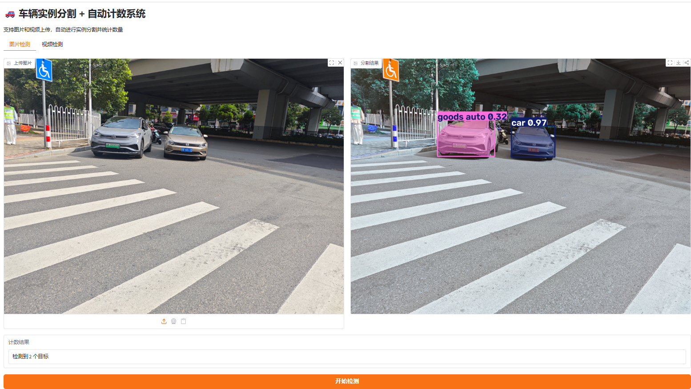
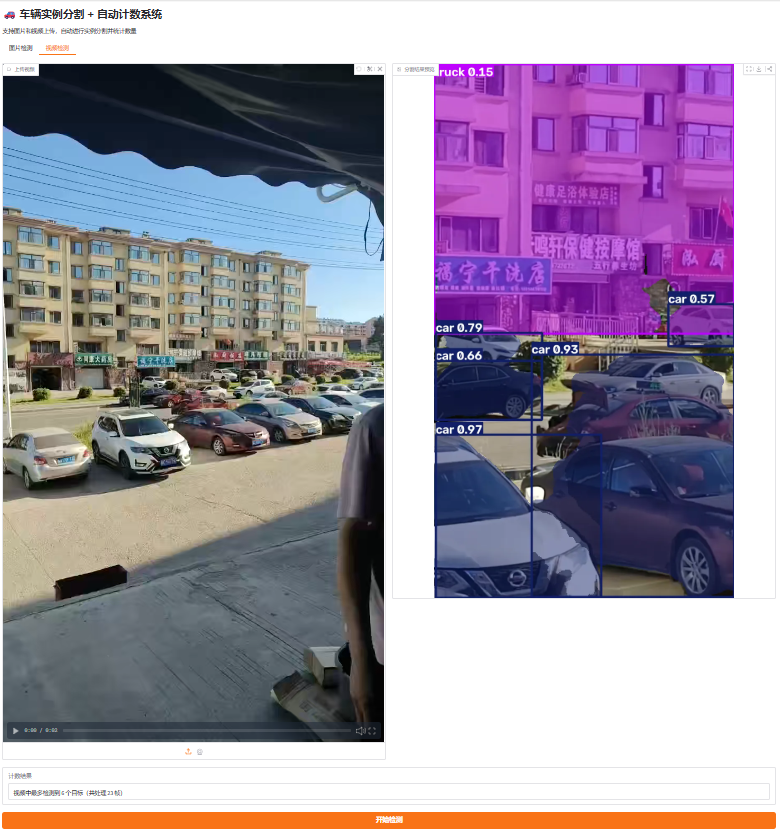

# 🚗 车辆实例分割 + 自动计数系统

基于 **YOLOv8-seg** 实现的车辆实例分割与自动计数系统，支持图片和视频的像素级分割与实时数量统计。

## 在线演示

**[🔗 点击体验 Demo](https://1606da88289db6f6fd.gradio.live)**

## 项目展示

### 功能特点
- 车辆实例分割（像素级掩码）
- 自动目标计数
- 支持图片和视频检测
- 多类别车辆识别（car、truck、bus 等）

### 效果展示





## 技术栈
- **模型**：YOLOv8n-seg
- **框架**：Ultralytics
- **Web Demo**：Gradio
- **数据集**：Roboflow Vehicle Counting Dataset

## 如何运行

```bash
pip install ultralytics gradio opencv-python
python app.py
```

## 模型下载

训练完成的权重文件：
**[📥 点击下载 best.pt]([这里粘贴你的Google Drive链接](https://drive.google.com/file/d/1jj226H1FvY-KoIPanW59lRuc3Xh0RifP/view?usp=sharing
))**
